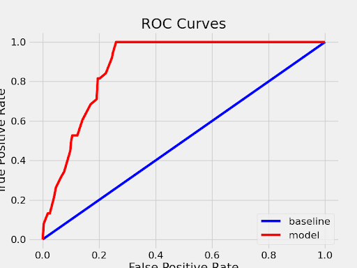
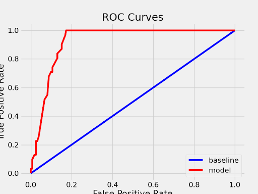
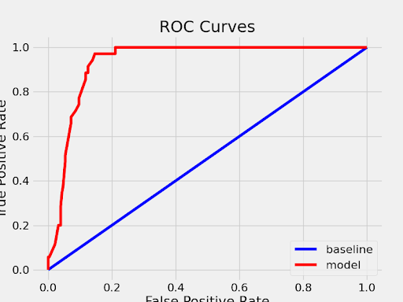
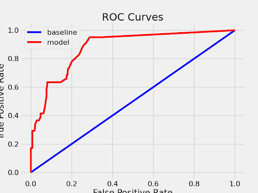

## Passive Room Sensing using OpenSHS
 
ECE209AS Final Project

Cian Costello, Andrew Chen, Mrunal Patel

### Abstract 
Motion sensors are becoming more commonly used in applications ranging from smart homes to assisted living scenarios. These sensors provide a sense of security, but could also expose private information with their wirelessly transmitted messages. In a scenario where a malicious party can observe occurrences of motion sensor messages, occupant activities and behavioral patterns can be inferred. We present a novel approach to simulate the collection of limited smart home data and predict occupant behavior from room to room. With data generated from a smart home simulator, we train a random forest for each room and create a Markov transition matrix to predict current and next room movements given a motion sensor event. The applications of this model can be extended to the detection of anomalous elderly behavior or simply learning living patterns of the residents.

### Proposal
We will use OpenSHS to simulate a smart home with multiple passive infrared (PIR) sensors. Data collected will be based on an actor or actors that will move throughout the home. Time stamped data from the motion sensors will be used to infer room transitions, predict occupant locations, and recognize human activity patterns. We will experiment with different models to predict the above metrics -- random forests, Markov chains, and/or Hidden Markov models. Note that after experiementation we found that HMMs would not apply to our project due to the lack of hidden states.

### Project Timeline
* Week 4 - Project definition and abstract, literature review complete
* Week 5 - OpenSHS setup and data collection
* Week 6 - Design floorplans in OpenSHS, continue data collection
* Week 7 - Use data with random forests for predicting rooms
* Week 8 - Use data with Markov chain for prediciting next room
* Week 9 - Create pipeline and evaluate results; consider stretch goals
* Week 10 - Finalize presentation and project report

### Prior Work
Our initial literature review focused on passive infrared (PIR) motion sensors, and their usage in human tracking applications. Song et al. [1] use PIR sensors to perform region based human tracking. Six sensors placed around the ceiling of an office building are used to track the movement of a single person, with regions defined by sensor range and overlaps. Zappi et al. [2] demonstrate that more precise information can be derived from pairs of PIR sensors facing each other, by using feature extraction with simple supervised learning algorithms to classify movements of people.

A 2017 paper by Luo et al. [3] uses PIR sensors for simultaneous indoor tracking and activity recognition. The paper involves an active setup of groups of sensors on the roof. Each group is arranged in a special way such that the subject can be tracked using bearing and radial segmentation. They use a particle filter to determine the location of the human target. Lastly, they have a two-layer random forest to classify the activity that the human target is performing. They can determine static actions with an accuracy of over 90% (mobile actions were between 60 and 70%).

Another related work on fall detection makes the case for PIR sensors to be used as an alternative to cameras [4]. Motion sensors, already cheaper than cameras, capture much less detail and information making them inherently better at preserving privacy. They also use roof-based sensors, where each sensor is a "pixel" that gets passed into an SVM classifier to obtain an average recognition rate of 80%.

---
A more relevant topic for our purposes invovles passive sensing, which can be preformed remotely by a malicious party. A 2020 paper from UCSB [5] uses passive sensing of ambient WiFi signals to detect humans. It does not need any prior knowledge of the WiFi network or devices (including location). Detection rates varied from 86.6-99.9% depending on the number of anchors. Additionally, work has been done to develop new signal processing algorithms for Ambient Assisted Living Applications (AAL) [6]. In this case, time spent in active state by the sensor signal as the best indication of movement intensity. 

Similar work has also been done on wireless snooping in heavily connected smart homes. Srinivasan et al. [7] presented the Fingerprint and Timing-based Snooping (FATS) attack, which eavesdrops on the wireless transmission of various sensors in a home to classify activities such as cooking, showering, or sleeping. This attack uses wireless fingerprinting and temporal data to cluster sensors by room and make tiered predictions. Various methods to defend against this attack are also presented, including signal attenuation, random delays, and fingerprint masking.

Other related work focused on building room connectivity graphs, which could be applied to the smart energy control of buildings with many rooms. Ellis et al. [8] deployed light and motion sensors into the rooms of a building to determine room connectivity. Predicitons of the next room transition could be used to optimize building energy consumption. The authors created transition matrices for both motion and ambient light sensors to produce their connectivity graphs. A similiar work by Lu and Whitehouse [9] explores a method for automatic generation of home floorplans, with the ability to derive floorplan orientation with respect to magnetic north. This method uses light, temperature, and motion sensors on doors, windows, and walls.

Our work incorporates elements of the previous two ideas in a more constrained scenario, by applying a malicious setting to the goal of learning room connectivity. We assume that an attacker has extracted each room's relevant motion sensor events. Another key difference is the use of a simulated smart home. While less realistic, it allows for more data collection and greater ease in varying the experimental setup. Our results prove the effectiveness of using a simulator like OpenSHS to contribute to applications of malicious passive sensing. 

### Data Collection: OpenSHS
The data collection for our project was done using Open Smart Home Simulator (OpenSHS). This was created in 2017 by Alshammari et al. [10], using the Blender Game Engine and Python to generate 3D simulations of smart homes. The purpose of OpenSHS is to generate large datasets for IoT and machine learning research. We chose to use this platform because it is open source and cross platform, allowing us to develop and test our project on both Mac and Windows machines. Other benefits of OpenSHS include the existing implementation of motion sensors and the interactive usage that allows customized data recording.

Despite clear benefits, we had to make some changes to OpenSHS to fit our project. By default, the smart home in OpenSHS has a wide array of sensors attached to lights, doors, furniture, and appliances. We created an idealized data output with only motion sensor data to more easily use with our predictive models. The motion sensors were implemented as contact sensors in the carpet of each room. More realistic models also exist, such as the "near" or "radar" sensors, which could introduce more uncertainty in measurements and be useful in future work. Additional modifications included adding a column of time stamps to our dataset and inserting a hallway motion sensor to capture data from every room in our sample house.

To process of collecting data works as follows:
1. Run the openshs python script with the "start" option and a context selected.
    ```
    python openshs start -c inside
    ```

2. Set a starting date and time by entering a value at the command line prompt.

3. Start the simulation in blender by pressing the "p" key on your keyboard.

4. Interact with the house, moving avatar with the wasd keys and moving the camera with a mouse. Click to interact with objects when a text prompt appears on the display. This should be done to replicate a daily routine: waking up, going to the bathroom, eating breakfast, etc.

5. Pause the simulation with the spacebar to assign labels to activities and set activity durations (by pressing z and entering a time in seconds).

6. Use the Esc key to end the simulation. The data collected from the simulation will be saved as a csv file with the start time included in the file name.

After a sufficient number of data samples was collected, we were able to use the aggregate feature of OpenSHS to expand our samples into a larger dataset. A replication algorithm is used that randomly draws from our manually collected samples. These samples are sorted based on their activity labeling and aggregated based on the number of activities in each sample. So in order for the aggregate function to be effective, we had to ensure that our manual data was properly labelled. The use of labels helps preserve the logical order of events and create more realistic sensor traces. The aggregate algorithm has options to set the number of days generated, the starting date, the start time variability, and the activity length variability.

### Random Forests

### Markov Chain

### Pipeline

### Results and Evaluation
Below are images of the ROC-AUC curves for our random forests. These are a good metric for evaluating the performance of our model, and show that the predictions outperform at least the baseline.

 

 



### Limitations and Future Directions
One key limitation with this implementation is the lack of support and limited documentation for OpenSHS. The simulator does function, but it was last updated in 2018. Additionally, the most recent version of Blender discontinued the use of the Blender Game Engine, which is required for performing these simulations. Version 2.79 of Blender still supports the game engine. 

An area of future work for this project would be extending the room tracking to multiple users. This would require future development of the OpenSHS framework to better support two actors. A simple way to achieve this would be rerunning simulations that overlap in time and combine their data outputs. This would produce a sensor trace for a multi-occupant home, to which we could apply our models. In terms of data collection, we could improve the automation of the OpenSHS process. Blender also supports other types of motion sensors, such as the Near and Radar sensors. These could make the data more realistic and add some uncertainty to our measurements. 

Deep learning methods, such as LSTM networks, were briefly considered at the start of this project. Due to the limited data and few features, we did not experiment with such methods. But with modifications to the problem, utilizing some form of memory could be useful to gain new insights on occupant behavior. This could be an avenue for future work.

### References

1) B. Song, H. Choi, and H. S. Lee, “Surveillance Tracking System Using Passive Infrared Motion Sensors in Wireless Sensor Network,” in 2008 International Conference on Information Networking, 2008, pp. 1–5. [Link](https://ieeexplore.ieee.org/abstract/document/4472790)

2) P. Zappi, E. Farella, and L. Benini, “Tracking Motion Direction and Distance With Pyroelectric IR Sensors,” IEEE Sens. J., vol. 10, no. 9, pp. 1486–1494, 2010. [Link](https://ieeexplore.ieee.org/abstract/document/5503973)

3) X. Luo, Q. Guan, H. Tan, L. Gao, Z. Wang, and X. Luo, “Simultaneous Indoor Tracking and Activity Recognition Using Pyroelectric Infrared Sensors,” Sensors (Basel)., vol. 17, no. 8, p. 1738, Jul. 2017. [Link](https://www.ncbi.nlm.nih.gov/pmc/articles/PMC5580159/)

4) S. Tao, M. Kudo, and H. Nonaka, “Privacy-Preserved Behavior Analysis and Fall Detection by an Infrared Ceiling Sensor Network,” Sensors , vol. 12, no. 12. 2012. [Link](https://www.mdpi.com/1424-8220/12/12/16920)

5) Y. Zhu et al., “Et Tu Alexa? When Commodity WiFi Devices Turn into Adversarial Motion Sensors,” arXiv e-prints, p. arXiv:1810.10109, Oct. 2018. [Link](https://arxiv.org/pdf/1810.10109.pdf)

6) T. Kovácsházy and G. Fodor, “New approach to passive infrared motion sensors signal processing for Ambient Assisted Living Applications,” in 2012 IEEE International Instrumentation and Measurement Technology Conference Proceedings, 2012, pp. 2521–2525. [Link](https://ieeexplore.ieee.org/abstract/document/6229464)

7) V. Srinivasan, J. Stankovic, and K. Whitehouse, “Protecting Your Daily In-Home Activity Information from a Wireless Snooping Attack,” in Proceedings of the 10th International Conference on Ubiquitous Computing, 2008, pp. 202–211. [Link](https://doi.org/10.1145/1409635.1409663)

8) C. Ellis, J. Scott, I. Constandache, and M. Hazas, “Creating a Room Connectivity Graph of a Building from Per-Room Sensor Units,” in Proceedings of the Fourth ACM Workshop on Embedded Sensing Systems for Energy-Efficiency in Buildings, 2012, pp. 177–183. [Link](https://doi.org/10.1145/2422531.2422563)

9) J. Lu and K. Whitehouse, “Smart Blueprints: Automatically Generated Maps of Homes and the Devices Within Them BT  - Pervasive Computing,” 2012, pp. 125–142. [Link](https://link.springer.com/chapter/10.1007/978-3-642-31205-2_9)

10) N. Alshammari, T. Alshammari, M. Sedky, J. Champion, and C. Bauer, “OpenSHS: Open Smart Home Simulator,” Sensors , vol. 17, no. 5. 2017. [Link](https://www.mdpi.com/1424-8220/17/5/1003/htm)
